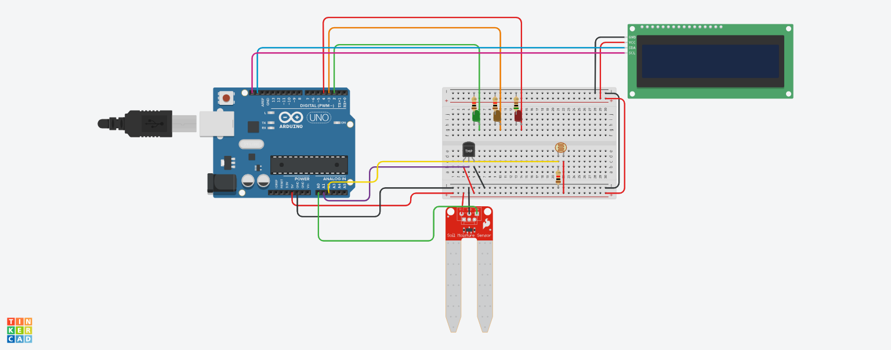
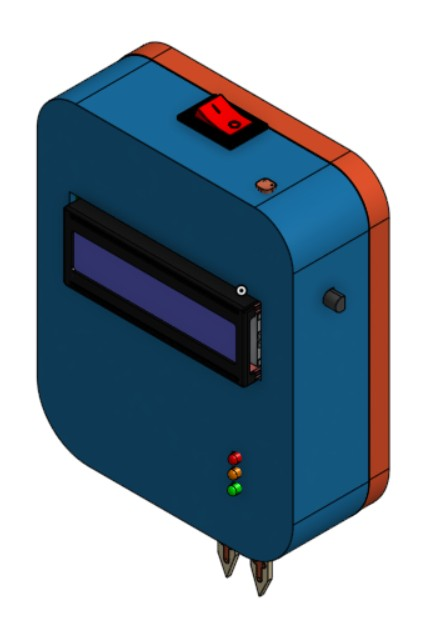

# RBN_Soil_Detector_Project1-2-FD

A multi-sensor soil detector project capable of monitoring soil moisture, ambient temperature, light intensity, and humidity. Designed for small-scale agricultural applications, home gardening, and educational purposes.

---

## Features

- Real-time soil moisture detection
- Temperature, light, and humidity measurements
- Data display on an LCD screen
- Modular and easy-to-assemble design
- Compatible with Arduino UNO and ESP32

---

## Repository Contents

| File / Folder | Description |
|---------------|-------------|
| `Soil Detector.png` | Circuit diagram of the soil detector |
| `Soil Detector Schematic.pdf` | Detailed schematic for wiring the sensors |
| `Soil Detector Assembly/` | 3D CAD files for assembly parts |
| `Assembly 1.zip` | STEP files for 3D printing the assembly |
| `soil_detector1.ino` | Arduino code for the project |
| `Bill of Material` | List of all components used in the project |
| `README.md` | Project overview and instructions |

---

## Images

### Circuit Diagram


### 3D Assembly Preview


---

## Installation / Setup

1. Clone the repository:
   ```bash
   git clone https://github.com/yourusername/RBN_Soil_Detector_Project1-2-FD.git
